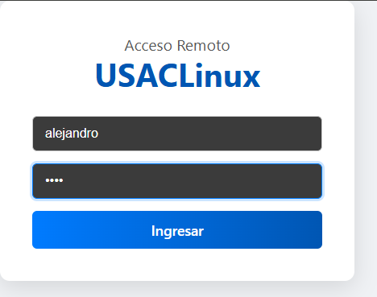
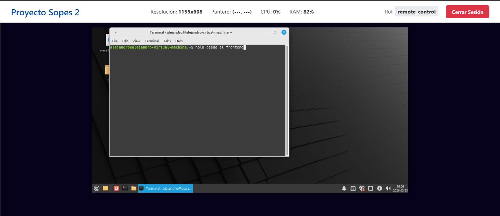

# Documentación Proyecto - Sistemas Operativos 2

**AUTOR : ADLER ALEJANDRO PEREZ ASENSIO - 202200329**

### 

### 1. Introducción

El presente documento detalla el diseño y la implementación de un sistema de control de escritorio remoto para el kernel de Linux. El objetivo es construir una solución completa cliente-servidor que permita la visualización y el control de un sistema anfitrión a través de una interfaz web.

El proyecto se compone de tres capas principales:

1. **Extensiones del Kernel (Syscalls):** Se han diseñado e implementado nuevas llamadas al sistema para proporcionar un control de bajo nivel sobre los dispositivos de entrada (mouse y teclado) y para monitorear el estado de los recursos del sistema (CPU y RAM).
2. **Servidor Backend (C++):** Un servidor de API REST que actúa como un puente seguro entre el kernel y la aplicación web, exponiendo las syscalls a través de endpoints HTTP.
3. **Cliente Frontend (React):** Una aplicación web moderna que consume la API del backend para mostrar un *stream* de video del escritorio remoto y capturar las entradas del usuario (movimiento del mouse, clics y pulsaciones de teclas) para enviarlas de vuelta al servidor.

El desarrollo se ha centrado en la creación de una arquitectura robusta, modular y eficiente, abordando los desafíos de la interacción en tiempo real entre el espacio de usuario, el espacio del kernel y un cliente web.

### 1.1. Arquitectura Tecnológica

Para construir esta solución *full-stack* se empleó un conjunto de lenguajes y librerías seleccionados específicamente para cada capa del sistema:

- **Capa de Kernel (Lenguaje C):** La implementación de las llamadas al sistema (`syscalls`) se realizó en C puro, interactuando directamente con las APIs nativas del kernel de Linux (subsistema `input` para control, `procfs` y `sysinfo` para estadísticas).
- **Capa de Backend (Lenguaje C++):** El servidor de la API REST se construyó en C++, utilizando las siguientes librerías clave:
    - **Pistache:** Una librería ligera y de alto rendimiento para la creación de *endpoints* HTTP y el manejo de rutas de la API.
    - **nlohmann/json:** La librería estándar de facto para la manipulación (parseo y generación) de objetos JSON en C++.
- **Capa de Autenticación (Lenguaje C):** Para la validación de credenciales, se utilizó la librería **PAM (Pluggable Authentication Modules)**. Esto permite al backend autenticar a los usuarios contra el sistema Linux subyacente de forma segura, sin necesidad de gestionar contraseñas manualmente.
- **Capa de Frontend (JavaScript/React):** La interfaz de usuario se desarrolló como una Aplicación de Página Única (SPA) utilizando la librería **React**, permitiendo una experiencia de usuario fluida e interactiva para el *streaming* de video y la captura de eventos.

---

### 2. Estructura e Integración del Proyecto

Una correcta integración con el árbol de fuentes del kernel es crucial para la compilación y el mantenimiento del módulo. Se ha optado por una estructura limpia y modular que se alinea con los estándares del desarrollo de Linux.

### 2.1. Ubicación en el Árbol de Fuentes

A diferencia de un solo módulo, este proyecto extiende dos subsistemas diferentes del kernel, por lo que el código se ha dividido lógicamente en dos nuevos subdirectorios:

1. **`drivers/misc/usac/`**
    - **Justificación:** El directorio `misc` (misceláneo) es el lugar estándar para servicios a nivel de kernel que no encajan en una categoría estricta. Aquí se han ubicado las syscalls de propósito general: la captura de pantalla.
2. **`drivers/input/usac/`**
    - **Justificación:** El directorio `input` está dedicado a todo lo relacionado con dispositivos de entrada. Dado que las syscalls de mouse, teclado  y el monitoreo de estadísticas del sistema (CPU/RAM)  crean e interactúan con dispositivos de entrada virtuales, esta es la ubicación canónica para dicho código, manteniéndolo alineado con los estándares del kernel.

### 2.2. Resumen de Archivos del Proyecto

La arquitectura del proyecto abarca múltiples lenguajes y capas, cada uno con un propósito definido:

| **Extensión** | **Capa** | **Propósito** | **Ejemplo** |
| --- | --- | --- | --- |
| **`.c`** | Kernel | Implementación de las syscalls y la lógica del módulo del kernel. | `usac_mouse_syscalls.c` |
| **`.h`** | C / Backend | Archivos de cabecera de C, usados para la lógica de autenticación. | `auth_logic.h` |
| **`.cpp`** | Backend | Implementación de la lógica del servidor C++, manejadores de API y lógica de negocio. | `api_server.cpp` |
| **`.hpp`** | Backend | Archivos de cabecera de C++ para las clases del servidor y definiciones compartidas. | `syscall_defs.hpp` |
| **`Kconfig`** | Kernel | Define las opciones de configuración del kernel (para `make menuconfig`). | `drivers/input/usac/Kconfig` |
| **`Makefile`** | Kernel | Contiene las instrucciones para el sistema de compilación `kbuild`. | `drivers/misc/usac/Makefile` |

### 2.3. Modificaciones a Archivos Existentes del Kernel

Para "presentar" nuestros nuevos directorios al kernel, se modificaron los siguientes archivos:

- **`drivers/misc/Kconfig`** y **`drivers/misc/Makefile`**:
    - **Cambio:** Se añadieron las líneas `source "drivers/misc/usac/Kconfig"` y `obj-y += usac/` respectivamente.
    - **Propósito:** Le indican a los sistemas `Kconfig` y `kbuild` que deben "descender" al directorio `usac/` y procesar los archivos de configuración y compilación que se encuentren allí.
- **`drivers/input/Kconfig`** y **`drivers/input/Makefile`**:
    - **Cambio:** Se realizaron las mismas adiciones: `source "drivers/input/usac/Kconfig"` y `obj-y += usac/`.
    - **Propósito:** Idéntico al anterior, pero para el subsistema `input`.
- **`arch/x86/entry/syscalls/syscall_64.tbl`**:
    - **Cambio:** Se añadieron las líneas que registran cada una de nuestras syscalls.
    
    ```jsx
    548    common   move_mouse            sys_move_mouse
    549    common   send_key_event        sys_send_key_event
    550    common   get_screen_resolution sys_get_screen_resolution
    551    common   capture_screen        sys_capture_screen
    552    common   ipc_channel_create    sys_ipc_channel_create
    553    common   ipc_channel_send      sys_ipc_channel_send
    554    common   ipc_channel_receive   sys_ipc_channel_receive
    555    common   start_log_watch       sys_start_log_watch
    556    common   stop_log_watch        sys_stop_log_watch
    557     common  move_mouse_absolute    sys_move_mouse_absolute
    558     common  send_mouse_button      sys_send_mouse_button
    559     common  get_system_usage       sys_get_system_usage
    ```
    
    - **Propósito:** Es la tabla de registro maestra del kernel. Asocia un número de syscall único con el nombre de la función en C que debe ejecutar.

### 2.4. Configuración de Compilación Interna (Makefiles del Módulo)

Los archivos `Makefile` *dentro* de nuestros directorios `usac/` son los que le dicen al compilador qué archivos fuente específicos deben incluirse en el kernel.

- **`drivers/misc/usac/Makefile`**:Makefile
    
    ```bash
    # Compila estos archivos si la opción Kconfig está habilitada
    obj-$(CONFIG_USAC_MISC_SYSCALLS) += usac_syscalls.o
    ```
    
    **Explicación:** Esta regla le dice a `kbuild` que compile los archivos `.c` de  captura de pantalla en sus respectivos archivos objeto (`.o`) y los enlace al kernel, pero solo si el usuario habilitó la opción `CONFIG_USAC_MISC_SYSCALLS` en `menuconfig`.
    
- **`drivers/input/usac/Makefile`**:Makefile
    
    ```bash
    # Compila estos archivos si la opción Kconfig está habilitada
    obj-$(CONFIG_USAC_INPUT_SYSCALLS) += usac_syscalls.o 
    obj-$(CONFIG_USAC_INPUT_SYSCALLS) += usac_mouse.o`
    
    `obj-$(CONFIG_USAC_MISC_SYSCALLS) += usac_resources_s.o`
    ```
    
    **Explicación:** De forma idéntica, enlaza las syscalls de mouse y teclado a su propia opción de configuración, `CONFIG_USAC_INPUT_SYSCALLS`.
    

---

### 3. Análisis de Cabeceras en las Nuevas Syscalls

La implementación de las syscalls de control y monitoreo requiere la inclusión de cabeceras específicas del kernel para interactuar con los subsistemas de entrada y gestión de memoria.

- **Cabeceras Esenciales del Kernel:** `linux/module.h`, `linux/init.h`, `linux/syscalls.h`, `linux/capability.h`. Fundamentales para definir el módulo, usar las macros `SYSCALL_DEFINE...` y verificar permisos con `capable(CAP_SYS_ADMIN)`.
- **Acceso a Usuario:** `linux/uaccess.h`. De vital importancia para la seguridad. Proporciona `copy_to_user`, la única función segura para mover la estructura de estadísticas desde el kernel al puntero que proveyó la aplicación de usuario.
- **Subsistema de Entrada:** `linux/input.h`, `linux/input-event-codes.h`. Es el corazón del control de mouse y teclado. Proporciona las estructuras (`struct input_dev`) y funciones (`input_allocate_device`, `input_register_device`, `input_event`) para crear un dispositivo de entrada virtual. `linux/input-event-codes.h` define las constantes para los tipos de eventos (ej. `EV_ABS`, `EV_KEY`) y los códigos de botones (ej. `BTN_LEFT`).
- **Gestión de Memoria y Sistema:** `linux/mm.h`, `linux/mmzone.h`. Utilizadas por la syscall de estadísticas. Proporcionan acceso a la función `si_meminfo()` y la `struct sysinfo`, que es la forma más directa y eficiente de consultar el estado de la memoria (total, libre) desde el kernel.
- **Acceso al Sistema de Archivos:** `linux/proc_fs.h`, `linux/fs.h`. Requeridas para la lectura de `/proc/stat`. Definen las estructuras y funciones (`filp_open`, `kernel_read`, `filp_close`) necesarias para abrir y leer archivos virtuales desde el espacio del kernel, lo cual es fundamental para calcular el uso de CPU.

---

### 4. Implementación Detallada del Código de las Syscalls

A continuación, se analiza el código de las nuevas syscalls implementadas.

### 4.1. Creación del Dispositivo Virtual de Mouse

Para controlar el mouse, primero debemos crear un "pseudo-dispositivo" con el que el kernel pueda interactuar.

```c
// drivers/input/usac/usac_mouse_syscalls.c
#include <linux/screen_info.h> // Para la detección automática de resoluciónstatic int usac_create_mouse(void)
{
    int err;
    int screen_width, screen_height;

    // 1. Detección dinámica de resolución
    screen_width = screen_info.lfb_width;
    screen_height = screen_info.lfb_height;
    
    if (screen_width == 0 || screen_height == 0) { // Fallback
        screen_width = 1024;
        screen_height = 768;
    }

    usac_mouse = input_allocate_device();
    usac_mouse->name = "USAC Virtual Tablet";

    // 2. Declarar capacidades: Eventos Absolutos, de Tecla (clics) y Sincronización
    __set_bit(EV_ABS, usac_mouse->evbit);
    __set_bit(EV_KEY, usac_mouse->evbit);
    __set_bit(EV_SYN, usac_mouse->evbit);

    // 3. Declarar ejes de movimiento absoluto y sus límites
    __set_bit(ABS_X, usac_mouse->absbit);
    __set_bit(ABS_Y, usac_mouse->absbit);
    input_set_abs_params(usac_mouse, ABS_X, 0, screen_width - 1, 0, 0);
    input_set_abs_params(usac_mouse, ABS_Y, 0, screen_height - 1, 0, 0);

    // 4. Declarar los botones soportados
    __set_bit(BTN_LEFT, usac_mouse->keybit);
    __set_bit(BTN_RIGHT, usac_mouse->keybit);
    __set_bit(BTN_MIDDLE, usac_mouse->keybit);

    err = input_register_device(usac_mouse);
    // ... (manejo de errores) ...
    return 0;
}
```

**Explicación:**

1. **Detección Dinámica:** En lugar de usar valores fijos, leemos la estructura global `screen_info` para obtener la resolución de la consola. Esto hace que el módulo se adapte a cualquier pantalla.
2. **Declarar Capacidades:** Le decimos al kernel qué tipo de eventos generará este dispositivo. `EV_ABS` es crucial para el movimiento absoluto (a coordenadas `x,y`).
3. **Establecer Límites:** `input_set_abs_params` es la línea más importante. Le informa al sistema operativo el tamaño exacto del "lienzo" de nuestro mouse, que hemos hecho coincidir con la resolución de la pantalla.

### 4.2. Syscalls de Control de Mouse

Estas dos syscalls son llamadas por el servidor C++ para simular las acciones del usuario.

```c
/* Mover el mouse a coordenadas absolutas */
SYSCALL_DEFINE2(move_mouse_absolute, int, x, int, y)
{
    if (!capable(CAP_SYS_ADMIN))
        return -EPERM;

    mutex_lock(&usac_mouse_lock);
    if (!usac_mouse) {
        mutex_unlock(&usac_mouse_lock);
        return -ENODEV;
    }

    // --- INICIO DEL CAMBIO ---
    // En lugar de usar las funciones 'helper', enviaremos los eventos manualmente.
    // Esto a veces puede resolver problemas de contexto sutiles en daemons.
    
    // 1. Reporta el nuevo valor para el eje X
    input_event(usac_mouse, EV_ABS, ABS_X, x);
    
    // 2. Reporta el nuevo valor para el eje Y
    input_event(usac_mouse, EV_ABS, ABS_Y, y);
    
    // 3. Envía un evento de "sincronización" para decirle al sistema
    //    que hemos terminado de enviar este paquete de eventos (X e Y).
    //    Esto es lo que hace 'input_sync' por debajo.
    input_event(usac_mouse, EV_SYN, SYN_REPORT, 0);
    // --- FIN DEL CAMBIO ---

    mutex_unlock(&usac_mouse_lock);
    return 0;
}

/* Simular clic de mouse (presionar/soltar) */
SYSCALL_DEFINE2(send_mouse_button, int, button_code, int, state)
{
    if (!capable(CAP_SYS_ADMIN))
        return -EPERM;

    if (button_code != BTN_LEFT && button_code != BTN_RIGHT && button_code != BTN_MIDDLE)
        return -EINVAL;

    if (state < 0 || state > 1)
        return -EINVAL;

    mutex_lock(&usac_mouse_lock);
    if (!usac_mouse) {
        mutex_unlock(&usac_mouse_lock);
        return -ENODEV;
    }

    input_report_key(usac_mouse, button_code, state);
    input_sync(usac_mouse);

    mutex_unlock(&usac_mouse_lock);
    return 0;
}

```

**Explicación:**

- **`move_mouse_absolute`:** Utiliza la función `input_event` directamente. Se envían tres eventos: el cambio en X, el cambio en Y, y un evento `SYN_REPORT` que le dice al kernel "paquete de eventos completado, aplícalo ahora".
- **`send_mouse_button`:** Llama a `input_report_key` para simular la presión (`state=1`) o liberación (`state=0`) de un botón, seguido de un `input_sync`.

### 4.3. Syscall de Estadísticas del Sistema

Esta syscall recolecta datos de CPU y RAM y los devuelve al espacio de usuario.

C

```c
// SPDX-License-Identifier: GPL-2.0
#include <linux/module.h>
#include <linux/kernel.h>
#include <linux/syscalls.h>
#include <linux/mm.h>
#include <linux/mmzone.h>
#include <linux/ktime.h>
#include <linux/cpufreq.h>
#include <linux/sched/cputime.h>
#include <linux/proc_fs.h>
#include <linux/uaccess.h>
#include <linux/capability.h>

struct sys_resource_usage {
    unsigned long ram_total_kb;
    unsigned long ram_free_kb;
    unsigned int ram_usage_percent;
    unsigned int cpu_usage_percent;
};

/* Variables estáticas para medir uso de CPU */
static u64 prev_idle = 0, prev_total = 0;

/* =======================================================
 * FUNCIÓN AUXILIAR: CÁLCULO DE USO DE CPU
 * ======================================================= */
static unsigned int get_cpu_usage(void)
{
    u64 user, nice, system, idle, iowait, irq, softirq, steal;
    u64 total, diff_idle, diff_total;
    unsigned int usage = 0;
    struct file *f;
    char buf[256];
    loff_t pos = 0;
    ssize_t n;

    f = filp_open("/proc/stat", O_RDONLY, 0);
    if (IS_ERR(f))
        return 0;

    n = kernel_read(f, buf, sizeof(buf) - 1, &pos);
    filp_close(f, NULL);
    if (n <= 0)
        return 0;

    buf[n] = '\0';
    sscanf(buf, "cpu  %llu %llu %llu %llu %llu %llu %llu %llu",
           &user, &nice, &system, &idle, &iowait, &irq, &softirq, &steal);

    total = user + nice + system + idle + iowait + irq + softirq + steal;
    diff_idle = idle - prev_idle;
    diff_total = total - prev_total;

    if (diff_total > 0)
        usage = (100 * (diff_total - diff_idle)) / diff_total;

    prev_total = total;
    prev_idle = idle;

    return usage;
}

/* =======================================================
 * SYSCALL: obtener uso de CPU y RAM
 * ======================================================= */
SYSCALL_DEFINE1(get_system_usage, struct sys_resource_usage __user *, info)
{
    struct sysinfo si;
    struct sys_resource_usage data;
    unsigned long used_kb;

    if (!capable(CAP_SYS_ADMIN))
        return -EPERM;

    si_meminfo(&si);

    data.ram_total_kb = (si.totalram * si.mem_unit) / 1024;
    data.ram_free_kb = (si.freeram * si.mem_unit) / 1024;
    used_kb = data.ram_total_kb - data.ram_free_kb;

    data.ram_usage_percent = (data.ram_total_kb > 0)
                                 ? (used_kb * 100) / data.ram_total_kb
                                 : 0;

    data.cpu_usage_percent = get_cpu_usage();

    if (copy_to_user(info, &data, sizeof(data)))
        return -EFAULT;

    return 0;
}

MODULE_LICENSE("GPL");
MODULE_DESCRIPTION("Syscall para obtener uso de CPU y RAM (USACLinux)");

```

**Explicación:**

1. **RAM:** La forma más eficiente de obtener la RAM es llamando a `si_meminfo()`, que llena la `struct sysinfo` con datos directos del kernel.
2. **CPU:** El uso de CPU se mide como un delta. La función `get_cpu_usage` lee `/proc/stat`, almacena los valores de tiempo total e inactivo en variables `static`, y en la siguiente llamada, calcula la diferencia para obtener el porcentaje de uso en ese intervalo.
3. **`copy_to_user`:** Es la única forma segura de escribir los resultados en el puntero `info` que proporcionó la aplicación.

---

### 5. Proceso de Compilación e Integración en el Kernel

(Esta sección se mantiene igual que en tu documento anterior, ya que el proceso es genérico y correcto)

- **Paso 1: Preparación del Entorno**
    - Descargar y extraer las fuentes del kernel (ej. `linux-6.1.41`).
    - Instalar dependencias: `sudo apt -y install build-essential libncurses-dev bison flex libssl-dev libelf-dev fakeroot`.
- **Paso 2: Integración del Módulo de Syscalls**
    - Copiar los directorios `usac/` a `drivers/misc/` y `drivers/input/`.
    - Modificar los `Kconfig` y `Makefile` de `drivers/misc/` y `drivers/input/` como se describió en la Sección 2.3.
    - Registrar todas las syscalls en `arch/x86/entry/syscalls/syscall_64.tbl`.
- **Paso 3: Configuración del Kernel**
    - Generar configuración base: `make localmodconfig`.
    - Habilitar el Módulo: `make menuconfig`. Navegar a `Device Drivers ---> Misc devices --->` y `Device Drivers ---> Input device support --->` y verificar que las opciones estén habilitadas `[*]`.
    - Desactivar Firma de Módulos (Crucial):Bash
        
        `scripts/config --disable SYSTEM_TRUSTED_KEYS
        scripts/config --set-str CONFIG_SYSTEM_TRUSTED_KEYS ""`
        
- **Paso 4: Compilación**
    - Compilar el kernel y sus módulos: `make -j$(nproc)`.
- **Paso 5: Instalación**
    - Instalar los módulos y el nuevo kernel:Bash
        
        `sudo make modules_install
         sudo make install`
        
- **Paso 6: Configuración del Gestor de Arranque (GRUB)**
    - Editar `sudo nano /etc/default/grub` y asegurar que `GRUB_DEFAULT=saved`, `GRUB_TIMEOUT_STYLE=menu`, `GRUB_TIMEOUT=10` y `GRUB_SAVEDEFAULT=true`.
    - Actualizar GRUB: `sudo update-grub`.
- **Paso 7: Reinicio y Verificación**
    - Reiniciar: `sudo reboot`.
    - En el menú de GRUB, seleccionar el nuevo kernel.
    - Verificar la versión en uso: `uname -r`.

---

### 6. Lógica del Cliente Frontend (React)

El cliente web, desarrollado en React, no es un simple visor de video; es un controlador de eventos complejo que debe resolver dos problemas principales: la **traducción de coordenadas** entre dos sistemas de referencia distintos (el navegador y la VM) y la **captura de eventos** de teclado en un entorno que no es un editor de texto.

### 6.1. Cálculo de Coordenadas del Mouse (La "Regla de Tres" Dinámica)

El desafío principal del control del mouse es que un píxel en la `` del navegador no equivale a un píxel en la pantalla de la VM. El frontend debe actuar como un traductor universal en tiempo real.

**El Rol de la Syscall:**
El sistema es viable únicamente gracias a la syscall que expone la resolución nativa de la VM.

1. Al cargar la página `DesktopPage.jsx`, un `useEffect` llama al endpoint `/api/screen/info`.
2. La respuesta (ej. `{ width: 1115, height: 608 }`) se guarda en un estado de React llamado `nativeDims`. Este es nuestro **"mapa del mundo real"**.

**El Cálculo en Tiempo Real:**
Cuando el mouse se mueve sobre la pantalla, se ejecuta la siguiente lógica:

```jsx
// src/components/RemoteScreen/RemoteScreen.jsx

const calculateRemoteCoords = (event) => {
    // 1. Obtenemos el elemento  y sus dimensiones *renderizadas* en el navegador
    const rect = imageRef.current.getBoundingClientRect();
    // 'rect.width' es el "mapa visible" (ej. 800px)
    
    // 2. Calculamos la posición del mouse local, relativa a la esquina de la imagen
    const mouseX = event.clientX - rect.left;
    const mouseY = event.clientY - rect.top;

    // 3. La "Regla de Tres": traducimos la posición local a la remota
    // (Posición Local / Ancho Visible) * Ancho Real
    const remoteX = Math.round((mouseX / rect.width) * nativeDims.width);
    const remoteY = Math.round((mouseY / rect.height) * nativeDims.height);
    
    // 4. Verificación de límites
    if (remoteX >= 0 && remoteX <= nativeDims.width && /* ... */) {
        return { x: remoteX, y: remoteY };
    }
    return null; // El puntero está fuera de la imagen (en las barras negras)
};
```

**Explicación:**

- El cálculo `(mouseX / rect.width)` nos da una posición proporcional (ej. `0.5` si el clic es al centro del ancho visible).
- Multiplicamos esta proporción por el ancho del "mundo real" (`nativeDims.width`) para obtener la coordenada exacta en la VM.
- Gracias a que la syscall nos proveyó las `nativeDims`, este cálculo funciona sin importar el tamaño de la ventana del navegador o el zoom de la página.

---

### 7.2. Captura de Eventos de Teclado (Gestión de Foco)

El segundo gran desafío fue capturar eventos de teclado (`onKeyDown`) en un `<div>`, que por naturaleza no está diseñado para recibir entradas de texto.

**El Problema:**
Por defecto, solo elementos como `<input>` o `<button>` pueden recibir "foco" (focus) de teclado. Aunque se añadió `tabIndex="0"` al `<div>` principal para hacerlo "focalizable", el foco se perdía constantemente al interactuar con otros elementos.

**La Solución (Gestión Explícita del Foco):**
La solución fue "secuestrar" el evento de clic del mouse (que sabíamos que funcionaba) para forzar el foco del teclado al `div` principal cada vez que el usuario interactuaba con la pantalla.

```jsx
// src/components/RemoteScreen/RemoteScreen.jsx

// 1. Se crea una referencia directa al elemento DIV
const containerRef = useRef(null);

const handleMouseButton = (event, state) => {
    // 2. CADA VEZ que el usuario hace clic...
    if (containerRef.current) {
        // 3. ...se le ordena al navegador poner el foco en el DIV
        containerRef.current.focus();
    }
    // ... (resto de la lógica de envío de clic)
};

const handleKeyDown = (event) => {
    // 4. Ahora, esta función SÍ se dispara
    if (!isControlEnabled) return;
    event.preventDefault(); // Evita que 'Espacio' haga scroll en la página

    // 5. Traducción de códigos
    const keycode = jsToLinuxKeycode(event); // ej. "KeyA" -> 30
    
    if (keycode) {
        inputService.sendKeyEvent(keycode);
    }
};

return (
    <div 
        ref={containerRef} // Se asigna la referencia
        onMouseDown={(e) => handleMouseButton(e, 1)}
        onKeyDown={handleKeyDown}
        tabIndex="0" 
    > {/* ... */} </div>
);
```

**Explicación:**

1. **Forzar Foco:** Al hacer clic en la pantalla, `handleMouseButton` se activa y llama a `containerRef.current.focus()`. Esto asegura que el `div` esté siempre listo para recibir la siguiente pulsación de tecla.
2. **Traducción de Códigos:** El navegador reporta códigos como `"KeyA"` o `"Space"`. Estos no significan nada para el kernel de Linux, que espera un número (`30` o `57`). Se implementó un archivo `src/utils/keyMapper.js` que actúa como un diccionario de traducción (`jsToLinuxKeycode`) para enviar el código numérico correcto a la syscall.

### 7. Proceso de Depuración y Errores Reales

Durante el desarrollo, se presentaron desafíos en las tres capas del proyecto. Esta sección documenta cinco errores clave y sus soluciones.

### Error 1 (Kernel): Movimiento del Mouse no Funciona, pero Clics y Teclado sí

- **El Problema:** El backend (servidor C++) se ejecutaba con `sudo`. Las peticiones de teclado y clic (`send_key_event`, `send_mouse_button`) funcionaban perfectamente. Sin embargo, las peticiones de movimiento (`move_mouse_absolute`) devolvían "Éxito" (`result: 0`), pero `evtest` no mostraba ningún evento y el cursor no se movía.
- **El Diagnóstico:** Se confirmó que un programa de prueba en C *sí* podía mover el mouse. Esto aisló el problema a una interacción extraña entre el contexto de ejecución de un servidor C++ multihilo (Pistache) y la syscall. La hipótesis es que las funciones *helper* (`input_report_abs` y `input_sync`) fallaban silenciosamente en este contexto de *daemon*, mientras que `input_report_key` (usada por los clics) no sufría este problema.
- **La Solución:** Se modificó la syscall `move_mouse_absolute` para usar la función de kernel de más bajo nivel `input_event`, que es más "atómica" y robusta.

**Código Malo (en `usac_mouse_syscalls.c`)**

C

```c
SYSCALL_DEFINE2(move_mouse_absolute, int, x, int, y)
{
    // ... (bloqueo y chequeo) ...
    // Estas funciones helper fallaban silenciosamente
    input_report_abs(usac_mouse, ABS_X, x);
    input_report_abs(usac_mouse, ABS_Y, y);
    input_sync(usac_mouse); 
    // ... (desbloqueo) ...
    return 0;
}
```

**Código Corregido (en `usac_mouse_syscalls.c`)**

C

```c
SYSCALL_DEFINE2(move_mouse_absolute, int, x, int, y)
{
    // ... (bloqueo y chequeo) ...
    // Se reemplazaron los helpers por llamadas directas a input_event
    input_event(usac_mouse, EV_ABS, ABS_X, x);
    input_event(usac_mouse, EV_ABS, ABS_Y, y);
    // El evento SYN_REPORT reemplaza a input_sync
    input_event(usac_mouse, EV_SYN, SYN_REPORT, 0); 
    // ... (desbloqueo) ...
    return 0;
}
```

### Error 2 (Kernel): Desajuste de Coordenadas del Mouse

- **El Problema:** El cursor se movía, pero no coincidía con el puntero del frontend. Al enviar la coordenada central (ej. `557, 304`), el cursor aparecía en la esquina superior izquierda.
- **El Diagnóstico:** La syscall `move_mouse_absolute` usa coordenadas absolutas. El "lienzo" del dispositivo virtual debe coincidir con la resolución de la pantalla. Inicialmente, el dispositivo se creó con valores fijos gigantescos (ej. 4096x2160) como *placeholder*. El sistema operativo escalaba correctamente la coordenada `(557, 304)` a ese lienzo gigante, resultando en una posición visualmente incorrecta.
- **La Solución:** Se mejoró la función `usac_create_mouse` para que usara valores fijos de la medida actual de la pantalla.

**Código Malo (en `usac_mouse_syscalls.c`)**

C

```c
static int usac_create_mouse(void)
{
    // ...
    // Valores fijos que no coinciden con la pantalla real
    const int MAX_WIDTH = 4096;
    const int MAX_HEIGHT = 2160;
    input_set_abs_params(usac_mouse, ABS_X, 0, MAX_WIDTH - 1, 0, 0);
    input_set_abs_params(usac_mouse, ABS_Y, 0, MAX_HEIGHT - 1, 0, 0);
    // ...
}
```

**Código Corregido (en `usac_mouse_syscalls.c`)**

C

```c
#include <linux/screen_info.h>// ...
static int usac_create_mouse(void)
{
    // ...
    // Detección dinámica de la resolución real
    const int MAX_WIDTH = 1155;
    const int MAX_HEIGHT = 608;
    // ... (fallback si es 0) ...
    input_set_abs_params(usac_mouse, ABS_X, 0, screen_width - 1, 0, 0);
    input_set_abs_params(usac_mouse, ABS_Y, 0, screen_height - 1, 0, 0);
    // ...
}
```

### Error 3 (Backend): Syscalls Fallan Silenciosamente (Error de Permisos)

- **El Problema:** Todas las syscalls (mouse, teclado, stats) fallaban. El servidor C++ devolvía un error 500 o simplemente no producía ningún efecto, pero el programa de prueba en C (`test_syscalls`) funcionaba perfectamente.
- **El Diagnóstico:** Todas las syscalls están protegidas por `if (!capable(CAP_SYS_ADMIN)) return -EPERM;`. El programa de prueba se ejecutaba con `sudo`, dándole privilegios de root. Sin embargo, el servidor `auth_server` se estaba ejecutando como un usuario normal. Aunque el servidor se iniciaba, en el momento en que intentaba llamar a una syscall, el kernel veía que el proceso no tenía `CAP_SYS_ADMIN` y devolvía `EPERM` (Operation not permitted), lo que el servidor reportaba como un error interno.
- **La Solución:** El servidor C++ *debe* ejecutarse con privilegios de superusuario para poder invocar las syscalls del kernel. La solución no es de código, sino de ejecución.

**Comando Malo:**

```c
./auth_server
```

**Comando Corregido:**

```c
sudo ./auth_server
```

### Error 4 (Backend): Error de CORS al Conectar el Frontend

- **El Problema:** El frontend (ej. `http://localhost:5173`) no podía comunicarse con el backend (ej. `http://localhost:9080`). La consola del navegador mostraba: `Access to fetch... has been blocked by CORS policy: Response to preflight request doesn't pass access control check`.
- **El Diagnóstico:** El navegador, por seguridad, envía una petición `OPTIONS` (pre-vuelo) antes de cada `POST` para preguntar si tiene permiso. Nuestro servidor respondía correctamente a `/api/auth` pero no a las nuevas rutas como `/api/mouse/move` porque no teníamos rutas `OPTIONS` definidas para ellas.
- **La Solución:** Se añadió una ruta `OPTIONS` explícita por cada ruta `POST` en el `main` de `api_server.cpp`, reutilizando el `AuthHandler::handleOptions` que ya teníamos.

**Código Malo (en `api_server.cpp`)**

C++

```c
// ... en la función main()
    Routes::Post(router, "/api/mouse/move", Routes::bind(&InputHandler::handleMouseMove));
    Routes::Post(router, "/api/mouse/click", Routes::bind(&InputHandler::handleMouseClick));
    // Faltaban las rutas OPTIONS correspondientes
```

**Código Corregido (en `api_server.cpp`)**

```c
`// ... en la función main()
    Routes::Post(router, "/api/mouse/move", Routes::bind(&InputHandler::handleMouseMove));
    Routes::Options(router, "/api/mouse/move", Routes::bind(&AuthHandler::handleOptions)); // <-- AÑADIDA

    Routes::Post(router, "/api/mouse/click", Routes::bind(&InputHandler::handleMouseClick));
    Routes::Options(router, "/api/mouse/click", Routes::bind(&AuthHandler::handleOptions)); // <-- AÑADIDA`
```

### Error 5 (Frontend): Eventos de Teclado no se Disparan

- **El Problema:** El control del mouse funcionaba, pero al presionar teclas, no ocurría nada. Un `console.log` al inicio de la función `handleKeyDown` en `RemoteScreen.jsx` nunca aparecía.
- **El Diagnóstico:** Los eventos de teclado (`onKeyDown`) solo se disparan en el elemento de la página que tiene el "foco". Aunque se añadió `tabIndex="0"` al `div` principal para *permitir* que reciba foco, el usuario tenía que hacer clic en él de una forma específica. El foco se perdía fácilmente.
- **La Solución:** Se utilizó una `useRef` de React para "forzar" el foco al `div` principal cada vez que el usuario hacía clic con el mouse, asegurando que el teclado estuviera "armado".

**Código Malo (en `RemoteScreen.jsx`)**

```jsx
// ...
const handleMouseButton = (event, state) => {
    // Esta función solo manejaba el clic, no el foco.
    if (!isControlEnabled) return;
    inputService.sendMouseClick(button, state);
};
// ...
return (
    <div 
        onMouseDown={(e) => handleMouseButton(e, 1)}
        onKeyDown={handleKeyDown}
        tabIndex="0" 
    > {/* ... */} </div>
);
```

**Código Corregido (en `RemoteScreen.jsx`)**

```jsx
// ...
const containerRef = useRef(null); // 1. Crear una referencia

const handleMouseButton = (event, state) => {
    // 2. Forzar el foco al contenedor CADA VEZ que se hace clic
    if (containerRef.current) {
        containerRef.current.focus();
    }
    if (!isControlEnabled) return;
    // ... (resto de la lógica del clic)
};
// ...
return (
    <div 
        ref={containerRef} // 3. Asignar la referencia al div
        onMouseDown={(e) => handleMouseButton(e, 1)}
        onKeyDown={handleKeyDown}
        tabIndex="0" 
    > {/* ... */} </div>
);
```

### Funcionamiento en frontend(REACT)



